# RelayFlow — How It All Works

> A plain-English tour of the whole system, for anyone (even a first-week developer).
> The diagrams below render as drawings on GitHub.

---

## 1. What RelayFlow is, in one sentence

**RelayFlow is one AI assistant you chat with that can read and send messages across all your business channels — WhatsApp, Telegram, Slack, and Gmail — from a single place, and never sends anything without your approval.**

Think of it as a **smart chief-of-staff** sitting on top of your messaging apps. You talk to it in a chat box; it reads your groups, summarises them, drafts replies, sends to one group or all of them at once, runs things on a schedule, and watches channels for you.

---

## 2. The big picture

Everything runs as **one always-on program** (a "server") hosted on Railway. That one program does everything: it serves the website, runs the AI, talks to the messaging apps, handles payments, and sends emails.

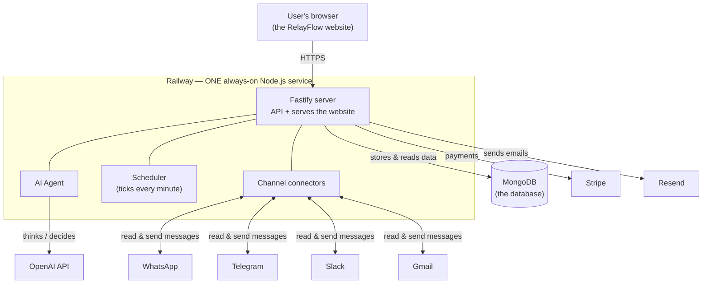

**Analogy:** the **server** is a restaurant kitchen. The **database** is the filing cabinet where everything is written down. **OpenAI** is the clever brain the kitchen phones for advice. **Stripe** is the cashier. **Resend** is the postman. The **connectors** are staff who go out and talk to WhatsApp/Telegram/Slack/Gmail.

---

## 3. The pieces (each explained simply)

| Piece | Plain English | Tech used |
|---|---|---|
| **Website (frontend)** | The pages you see and click — login, chat, connections, settings. | React + Vite + Tailwind |
| **Server (backend)** | The engine that answers every request and does the real work. | Fastify (Node.js), run with `tsx` |
| **Database** | The notebook that remembers users, chats, messages, monitors, etc. | MongoDB |
| **AI Agent** | The "brain" that reads your request and decides what to do. | OpenAI (model `gpt-5.6-sol`) |
| **Connectors** | The adapters that plug into each messaging app. | Baileys (WhatsApp), GramJS (Telegram), Slack API, Gmail API |
| **Scheduler** | A clock that wakes up every minute to run scheduled tasks & monitors. | node-cron |
| **Payments** | Free trials, plans, and credits. | Stripe |
| **Email** | OTP codes, password resets, monitor alerts. | Resend |

---

## 4. How a chat message flows (the core loop)

This is the heart of RelayFlow. When you type something in the chat:

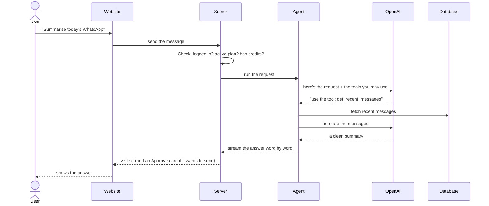

**Key idea — "tools":** the AI can't do anything on its own. It's only allowed to use a small, fixed set of **tools** we gave it:

- `list_connections` — which channels are connected?
- `list_destinations` — list my groups/channels by name.
- `get_recent_messages` — read recent messages (about the last week only).
- `prepare_send` — draft a message for me to approve (does **not** send).
- `prepare_schedule` — set up a timed task for me to approve.
- `prepare_monitor` — set up a watch for me to approve.

Because the toolbox is small and fixed, the AI stays on-task. If you ask it for something off-topic (e.g. "write me a landing page"), it politely refuses — that's a rule baked into its instructions.

---

## 5. Signing up & logging in (Auth)

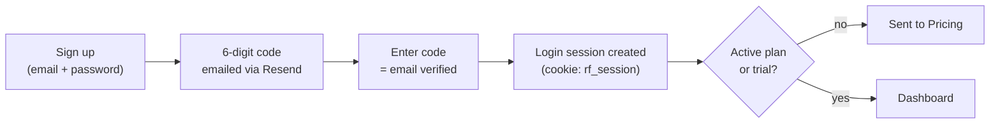

**In words:** you sign up, we email you a 6-digit code (OTP) to prove the email is yours. Once verified, we hand your browser a secret **session cookie** (`rf_session`) — like a wristband that says "this person is logged in." Passwords are stored **scrambled** (bcrypt), never in plain text. The wristband is checked on every request.

---

## 6. Payments & access control (Billing + gating)

RelayFlow is a paid product, so the dashboard is **locked** until you're on a plan.

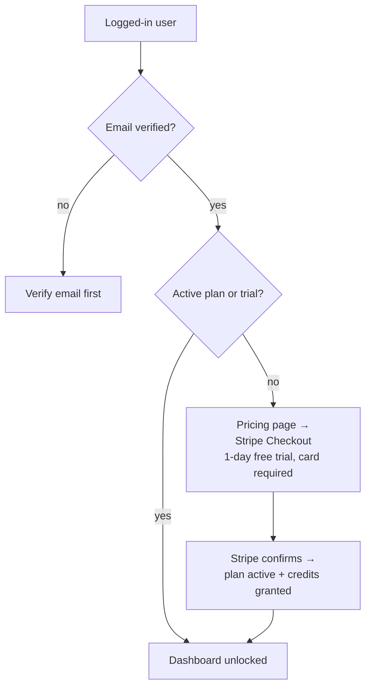

**In words:**
- Two plans: **Starter ($10/mo, 500 credits)** and **Growth ($30/mo, 2,000 credits)**.
- Everyone starts a **1-day free trial** (card required, not charged during the trial).
- A **credit** = one AI action. Each agent reply or monitor check that needs the AI uses one.
- **The lock is enforced on the server, not just the screen.** Every dashboard request runs through a gate (`requireActivePlan`): no login → blocked; email not verified → blocked; no active plan → blocked with a "payment required" signal. So nobody can sneak in by fiddling with the browser.
- **Stripe** handles the card and subscription; **webhooks** keep us updated when payments renew or fail.

---

## 7. Connecting your channels (Connectors)

Each messaging app connects differently, but once connected they all behave the same to the rest of the app.

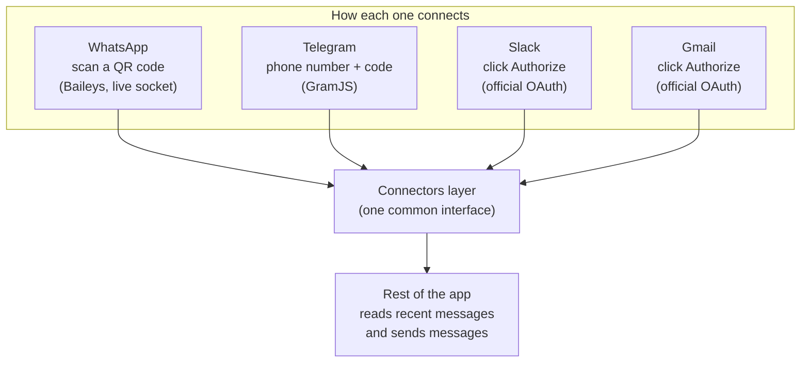

**In words:**
- **WhatsApp** links by scanning a QR code (like WhatsApp Web). After you scan, there's a short "Linking…" wait while it pairs.
- **Telegram** logs in with your phone number + the code Telegram sends you.
- **Slack** and **Gmail** use official "click to authorize" (OAuth) buttons.
- We only keep a **lightweight, recent slice** of messages (about a week) — never years of history.
- Login secrets for each channel are **encrypted** (AES-256-GCM) before being saved.

---

## 8. Sending a message (draft → approve → deliver)

This is the safety-critical part. **The AI never sends on its own.**

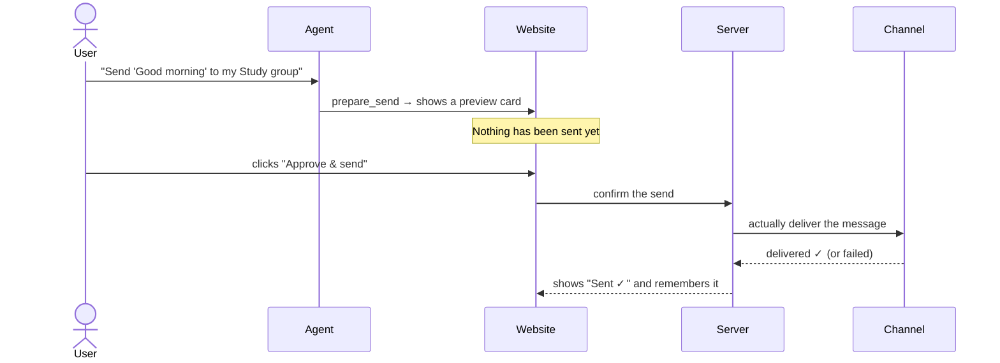

**In words:** the agent shows you a **preview card** with the exact message and destination. Only when you click **Approve** does it actually go out. Smart bits:
- **One channel, many groups = one button.** Different channels = one button each.
- After you approve, the result ("Sent ✓") is **saved**, so refreshing the page won't show the button again (no accidental double-sends).

---

## 9. Scheduled tasks (do something on a timer)

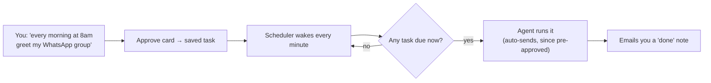

**In words:** you set it up once and approve it. A clock (node-cron) checks every minute for tasks that are due and runs them automatically. Because you pre-approved a scheduled task, it can send without asking each time.

---

## 10. Monitors (watch a channel and tell me when something happens)

The newest feature. **It checks on an interval and only pings you when a condition is truly met — never a message-by-message firehose.**

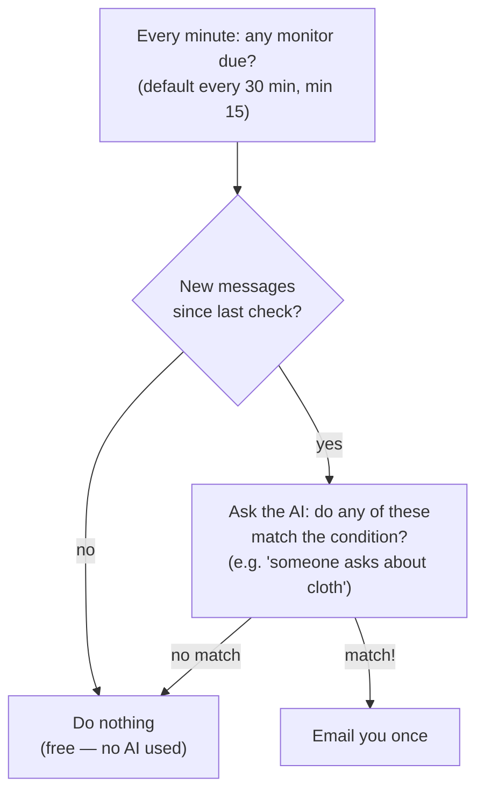

**In words:** you say *"let me know when someone asks about cloth in the Dev group."* Every 30 minutes RelayFlow peeks at what's new. If nothing new arrived, it does nothing (costs nothing). If there are new messages, the AI reads them and decides — *semantically* — whether any match (so "do you sell fabric?" counts even without the word "cloth"). It emails you **only on a real match**. There's also an **"absence" mode**: "tell me if the delivery confirmation *doesn't* arrive by tomorrow."

---

## 11. What's stored (the database, simply)

MongoDB holds a few "collections" (think: labelled drawers):

| Drawer | What's in it |
|---|---|
| `users` | accounts, plan, credits, billing status |
| `sessions` | who's logged in (the wristbands) |
| `auth_codes` | the 6-digit OTP codes (expire fast) |
| `chats` / `chat_messages` | your chat sessions and their messages |
| `connections` / `destinations` | your linked channels and their groups |
| `channel_messages` | the recent-messages cache (auto-deletes after 14 days) |
| `outbound` | a log of everything sent |
| `scheduled_tasks` | your timed tasks |
| `monitors` | your channel watches |
| `whatsapp_auth` | encrypted WhatsApp login state |

---

## 12. What keeps it safe (Security)

- **Passwords**: stored scrambled with bcrypt (never readable).
- **Sessions**: a random secret in an httpOnly cookie the browser can't leak to scripts.
- **Channel secrets**: encrypted (AES-256-GCM) at rest.
- **The paywall & login checks run on the server** — the screen hiding a button is just convenience; the server is the real guard.
- **The AI can only use its fixed toolbox**, and **can't send anything without your Approve click** — that guarantee is in the code, not just the AI's instructions. So even a tricky "prompt injection" hidden inside a group message can't make it fire off a message on its own.

---

## 13. How it's deployed

- **One service on Railway.** The same program serves the website and runs the API, agent, scheduler, and connectors. No separate servers, no Redis — cheap and simple.
- It runs the TypeScript directly with `tsx` (no separate build step for the server); the website is built once into static files the server hands out.
- Because it's **always on**, the scheduler and monitors keep ticking, and WhatsApp stays connected.

---

## 14. 🆕 Proposed feature: Knowledge Base + Auto-Reply

> **Status: designed, not yet built.** This section is the plan so you can see how it will work before we implement it.

### What it is (plain English)
Today RelayFlow answers **you** in the chat. This feature lets it answer **your customers** — automatically, on the channels you choose, using facts **you** give it.

A company adds a **Knowledge tab**, uploads or types their facts (products in stock, prices, opening hours, address, terms), writes **guardrails** ("answer product & pricing questions; never discuss refunds or give legal advice"), and flips on **auto-reply** for the channels they want. From then on, when a customer messages one of those channels, RelayFlow reads the message, checks the knowledge base, and — **only if it's confident the answer is in there and allowed** — replies on its own. If it's unsure, it stays quiet and leaves it for a human.

**The golden rule of this feature: silence beats a wrong answer.** A confident, grounded reply goes out; anything doubtful is left alone.

### Setup — the Knowledge tab

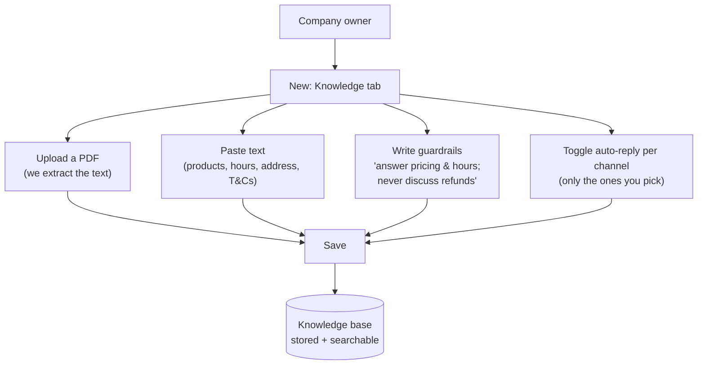

### The auto-reply pipeline (where the safety lives)

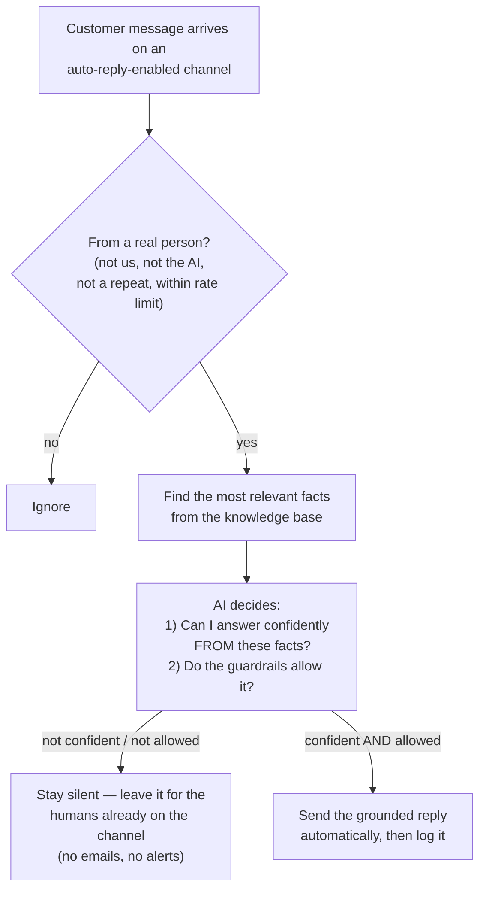

The AI is told: **only use the provided facts. If the answer isn't clearly in them, do not answer.** That's what stops it from making things up to a real customer.

### Where it plugs into each channel

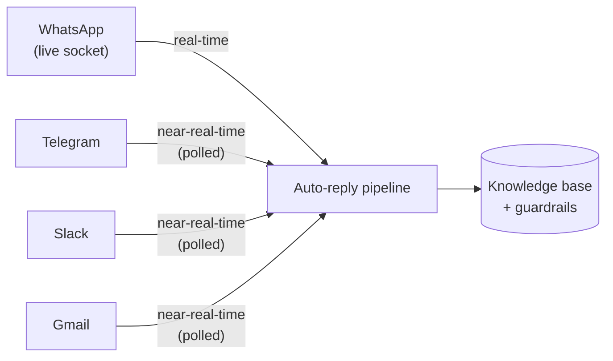

**Honest note on "real-time":** WhatsApp already has a live connection, so it's truly instant. Telegram/Slack/Gmail would start as **near-real-time** (checked on a short interval, reusing the same engine that powers monitors), and can become fully live later. So auto-reply on WhatsApp is the strongest first version.

### What gets stored

| New drawer | What's in it |
|---|---|
| `knowledge_base` | the guardrails/instructions + settings, per company |
| `knowledge_docs` | each uploaded/typed document's text (and, in Phase 2, searchable "chunks") |
| `connections` (existing, +field) | `autoReplyEnabled` on/off per channel, plus a mode (see below) |
| `auto_replies` | a log of every incoming question, the reply, and the confidence — so you can audit what the AI said |

### How it finds the right facts (retrieval)
- **Phase 1 (simple):** if the knowledge is small (a few pages), we hand the AI the **whole knowledge base** with each question. Easy, works immediately.
- **Phase 2 (scales):** for big knowledge bases, we split documents into chunks, turn them into **embeddings** (numerical meaning), and use **MongoDB Atlas Vector Search** to fetch only the few most relevant chunks per question. This keeps it fast and cheap even with hundreds of pages. (We already use Atlas, so this is a natural upgrade.)

### Safety & the "don't be reckless" design
Auto-reply means the AI sends **without you approving each message** — that's the point, and you opted in per channel. So the protections are:
- **Confidence gate** — replies only when the answer is clearly grounded in your facts; otherwise silent.
- **Guardrails** — your "answer this / never that" rules are enforced every time.
- **No loops** — it never replies to its own messages or your outgoing ones; rate-limited and de-duplicated so one customer never gets spammed.
- **Full log** — every auto-reply is recorded so you can review what it said (in the Knowledge tab).
- **Quiet when unsure — on purpose.** It does **not** email or alert you for questions it can't answer. RelayFlow **augments** your team; it doesn't replace them. The people on the channel are still there and will see anything the AI left alone — peppering them with "couldn't answer" emails would be noise, so we don't.
- **Credits** — each incoming message on an auto-reply channel may use a credit (an AI check), so cost scales with volume.
- **"Suggest mode" (future option)** — a later toggle to have it draft and wait for approval instead of sending, for companies that want to ease in.

### Decided (locked in)
- **Groups, exactly as today — no DM change.** Auto-reply runs inside the **selected groups** on each connected channel. Nothing about how channels connect changes.
- **Full auto** from day one: confident, grounded replies send immediately (no per-message approval).
- **When unsure → stay completely silent. No emails, no alerts.** The humans on the channel handle anything the AI can't. RelayFlow augments the team, it doesn't replace them.
- **All four channels.** WhatsApp is truly real-time (live socket); Telegram/Slack/Gmail are near-real-time (short polling, same engine as monitors).

### Suggested phases
- **Phase 1 (MVP):** Knowledge tab (paste text + PDF upload → extracted text) · guardrails · per-channel auto-reply toggle · **WhatsApp** real-time auto-reply · whole-KB-in-prompt · confidence gate · silent-when-unsure · reply log.
- **Phase 2:** near-real-time auto-reply on Telegram/Slack/Gmail · Atlas Vector Search for large knowledge bases · optional "Suggest mode" · a simple analytics view (answered / skipped).

---

## 15. Mini-glossary for newcomers

- **Frontend / backend** — the part you see (frontend) vs. the engine behind it (backend).
- **API** — the set of "doors" the website knocks on to ask the server to do things.
- **OTP** — the one-time 6-digit code emailed to verify you.
- **Session / cookie** — the "logged-in wristband" your browser carries.
- **OAuth** — the "Sign in with Google/Slack" click-to-authorize flow.
- **Tool (for the AI)** — a specific action the AI is allowed to take (read messages, prepare a send, etc.).
- **Credit** — one unit of AI usage; plans include a monthly bucket.
- **Webhook** — Stripe phoning us to say "this payment happened."
- **node-cron** — a built-in timer that runs code on a schedule.

---

*RelayFlow — by Levi app.*
